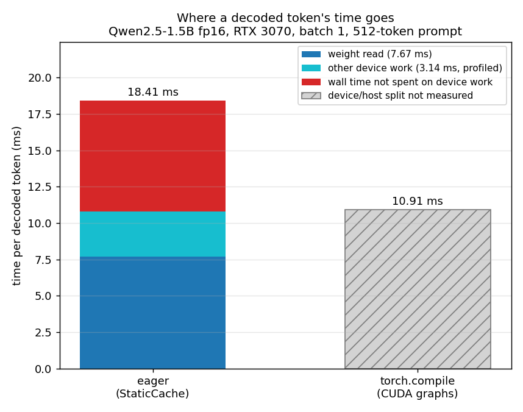

# Moving to a faster card made decoding slower

Decoding one token at a time is often limited by memory bandwidth, so I expected
a card with more bandwidth to decode faster. It did not: an RTX 3070 Ti with 608
GB/s decoded Qwen2.5-1.5B at 30.56 tokens per second, while an RTX 4060 Ti with
288 GB/s reached 70.09.

The three-card comparison didn't tell me why. But it did show that memory
bandwidth alone couldn't explain the result. On the system I investigated,
host-side dispatch became a significant part of the critical path for batch-1
eager decoding. With the hardware untouched, capturing the decode step as a CUDA
graph increased throughput by 1.687x in the controlled comparison.

## The thing that did not make sense

I ran the same script on three rented single-GPU machines: same model, same
prompt length, same number of generated tokens, same batch size of 1, and plain
HuggingFace `transformers` in eager mode.

| GPU | Bandwidth | Decode | Host CPU | MBU |
| --- | --- | --- | --- | --- |
| RTX 4060 Ti | 288 GB/s | 70.09 tok/s | i7-11700 | 75.2% |
| RTX 3070 | 448 GB/s | 59.75 tok/s | Ryzen 7 3700X | 41.2% |
| RTX 3070 Ti | 608 GB/s | 30.56 tok/s | Xeon E5-2680 v4 | 15.5% |

MBU estimates what fraction of the GPU's specified memory bandwidth would be
needed to stream the model weights once per generated token at the measured
decode rate. I calculate it as 3.088 GB of weights × tokens/s, divided by the
GPU's specified bandwidth.

The result was almost exactly backwards from what I expected.

The 3070 Ti has 2.11× the memory bandwidth of the 4060 Ti, but produces only
0.44× as many tokens per second. And the GPU with the lowest specified bandwidth
is the one whose measured throughput implies the highest fraction of its
theoretical bandwidth.

*Decode throughput against vendor memory bandwidth, batch 1, eager transformers.
Each point is a different machine, so this is an observation, not a controlled
comparison.*

That was strange because the usual mental model for batch-1 decode is fairly
simple: generating a token requires streaming the model weights through GPU
memory, so memory bandwidth should impose a strong ceiling on throughput. And yet
these runs were nowhere near that ceiling. On the 3070 Ti, the measured
throughput corresponds to only 15.5% of its specified bandwidth. The workload
was clearly not saturating the GPU's available memory bandwidth. Something else
was setting the pace.

The CPU was the next obvious suspect. The three machines had very different host
configurations, including their CPUs, and their decode speeds happened to move in
the same direction: the 4060 Ti system was fastest, the 3070 was in the middle,
and the 3070 Ti system was slowest.

But there was an obvious problem with that hypothesis: I had changed everything
at once. Different GPU. Different CPU. Different PyTorch/CUDA environment.
Different machine. I couldn't look at this table and say, "the CPU caused the
difference." I needed to hold everything else constant.

So I picked the RTX 3070, the middle row of the table, and used it for the rest
of the investigation. Every measurement from here on comes from that one machine.
If host-side dispatch really was limiting eager decode, then reducing the amount
of host work needed to submit GPU work should make the same GPU decode faster.

That was the experiment.

## Setup

For the controlled experiments, I used a single RTX 3070 machine rented from
Vast.ai. The GPU has 8 GiB of VRAM, 448 GB/s of specified memory bandwidth, 46
SMs, and compute capability 8.6. The host CPU is an AMD Ryzen 7 3700X, with 5.3
of its 16 logical cores allocated to my instance.

The model is Qwen2.5-1.5B running in FP16. It has 28 transformer layers, 12 query
heads, 2 KV heads, and a head dimension of 128. The model weights occupy 2,945.29
MiB in GPU memory, or about 3.088 GB of weight data.

Every benchmark uses a 512-token prompt, 255 generated tokens, greedy decoding,
and batch size 1. I measure prefill and decode separately, synchronize the GPU
before reading timers, discard one warmup generation, and reset peak-memory
counters before each run. The software stack is PyTorch 2.11.0+cu128 with
Transformers 4.46.3.

## Finding the real ceiling first

Before looking for another bottleneck, I wanted to establish how fast the RTX
3070 could decode if memory bandwidth were the only thing limiting it.

The card is specified at 448 GB/s. I initially looked at the bandwidth reported
by the hosting provider, but the number wasn't stable: Vast.ai reported 385.8
GB/s at one point and 179.6 GB/s earlier in the same session on the same machine.
That made it a poor number to use as a baseline.

So I measured the bandwidth myself. A large contiguous FP16 copy, using the best
result from 20 runs, sustained 402.6 GB/s of combined read and write traffic,
about 90% of the card's specified bandwidth.

The model has 3.088 GB of weights resident in memory. If those weights have to be
streamed once for every generated token, then at 402.6 GB/s, streaming them would
take:

$$
\frac{3.088\ \text{GB}}{402.6\ \text{GB/s}} = 7.671\ \text{ms}
$$

Under the assumption that each generated token requires streaming those 3.088 GB
of weights once, that gives a useful weight-streaming bound. At 402.6 GB/s the
weight read alone would take about 7.67 ms per token, corresponding to roughly
130.4 tokens per second. Actual inference can only be slower once the other work
in the decode step is included.

The actual HuggingFace decode rate was 59.75 tokens per second, the median of
five runs: 55.07, 59.76, 58.03, 60.25, and 59.75 tok/s. That's 16.74 ms per
token, more than twice the 7.671 ms it would take to stream the weights at the
measured bandwidth.

So each token had roughly 9.07 ms of additional time that couldn't be explained
by the weight read alone.

That gap was the number I cared about. If memory bandwidth was already capable of
supporting ~130 tok/s, why was eager decoding only reaching ~60?

I repeated the eager measurement five times because the instance shared its CPU
with other tenants. The runs varied by 9.4%, with the first run being the slowest
at 55.07 tok/s and the remaining four between 58.03 and 60.25 tok/s.

Now I had a concrete question to answer:

What was consuming that extra ~9 ms per token?

## Reducing host-side dispatch overhead, hardware unchanged

If repeated host-side dispatch is a significant part of the problem, reducing the
number of host submissions should recover some of the lost throughput.

In eager mode, producing a token walks all 28 layers and submits a long sequence
of small kernels to the GPU, one at a time as the Python code runs. `torch.compile`
with `mode="reduce-overhead"` can capture that repeated execution and use CUDA
graphs to reduce the cost of replaying it. In this experiment that means the host
no longer has to submit the same long sequence of individual kernel launches on
every decode step.

Both arms used a preallocated `StaticCache`. CUDA graphs require the captured
execution to see stable shapes and memory addresses, and a dynamically growing
cache can change layout or shapes between iterations, so the compiled path needed
a fixed cache. I used the same cache in the eager path as well, holding the cache
implementation constant while changing how the repeated decode work was captured
and submitted.

That is not a perfectly clean isolation of dispatch. `torch.compile` can also fuse
operations and generate different kernels, so the compiled path may be doing
device-side work differently too. What the comparison tests is whether a path that
substantially reduces repeated host-side dispatch can recover the missing
throughput.

The controlled comparison is therefore not "eager HuggingFace against an
optimised inference engine." It is the same HuggingFace workload, on the same
GPU, with the same model and the same cache, with the repeated decode execution
captured differently.

| arm | decode | ms/token | MBU | time beyond weight-streaming bound |
| --- | --- | --- | --- | --- |
| eager | 54.33 tok/s | 18.41 | 41.68% | 10.73 ms |
| compiled | 91.65 tok/s | 10.91 | 70.30% | 3.24 ms |

That is 1.687x, on the same card, in the same process, with the same model and
the same cache. Nothing about the hardware changed. Measured instead against the
59.75 tok/s from the previous section, the fastest eager configuration I had, the
gain is 1.53x.

The 1.687x figure is the controlled experiment. The 1.53x figure is the
comparison against the fastest normal eager configuration. They answer different
questions, so I report both.

The mechanism is that GPU kernels in this execution path are launched from the
CPU side, and the GPU cannot execute a kernel until that work has been submitted
to its command stream. Submitting each kernel individually costs something on the
host. When kernels are long, the launch and submission overhead is small
compared with their execution time. When kernels are short, the GPU can finish
the work already in its queue before the host has submitted enough additional
work to keep it busy.

Prefill is the sanity check. It moved from 65.36 ms to 66.97 ms, slightly slower
compiled than eager. That is what I would expect if the gain came from per-token
submission cost: prefill processes the whole prompt in one pass, so its kernels
are large enough to keep the GPU busy on their own, and there was no gap for
graphs to close. Decode is the opposite shape, many short kernels repeated once
per token.

Only one of the two phases moved, and it was the one made of small repeated work.

## A second measurement of the same thing

The throughput result is consistent with a dispatch explanation, but it doesn't
directly show the GPU waiting. So I profiled twelve steady-state decode steps
with `torch.profiler`, counting only device-side kernels.

One decoded token launches 1,282 CUDA kernels. Their total device time is 10.806
ms, which puts the average kernel at 8.429 microseconds. The largest single
contributor is a `gemv2T_kernel_val` half-precision kernel, 57 launches per token
totalling 5.019 ms.

Now put the profiler next to the wall-clock numbers from the previous section:

| arm | wall time | device time | wall not spent on device work |
| --- | --- | --- | --- |
| eager | 18.41 ms | 10.806 ms (profiled) | 7.60 ms (41%) |
| compiled | 10.91 ms | not profiled | unknown |

In eager mode the GPU was doing device work for about 10.8 ms, but the token took
about 18.4 ms. That leaves roughly 7.6 ms of wall-clock time not accounted for by
device-side kernel execution.

The compiled path takes 10.91 ms per token, which is only 0.1 ms above the
10.806 ms of device time measured on the eager path. If the compiled path does a
comparable amount of device-side work, there is very little room left for the
idle time eager mode shows. I did not profile the compiled path, so that is an
inference rather than a measurement, and `torch.compile` may well have changed
the device work too.

The wall-clock and profiler measurements point the same way. Eager decoding
spends about 7.6 ms per token outside device-side kernel execution, and the
compiled path cuts total token time to 10.91 ms. I cannot attribute all of that
reduction to eliminated GPU idle time, but the numbers are consistent with the
dispatch hypothesis.

*Per-token decode time on the RTX 3070, in milliseconds. Only the eager bar is
broken down, because only the eager path was profiled. The compiled bar shows
total wall time with no split, since I did not measure how its time divides
between device work and everything else.*

The measurements give a plausible explanation for the shape of the problem. 1,282
kernels per token, each averaging 8.429 microseconds of device time, is a very
large number of very short operations. At that duration, host-side submission
overhead can no longer be assumed negligible relative to execution time.

I want to be careful about how far that generalises. What this supports is that in
this batch-1 eager decode workload, host-side dispatch overhead was large enough
to keep the GPU from staying busy. It does not show that host overhead is
generally the bottleneck in LLM inference. The amount of work per kernel depends on several
factors, including batch size and sequence length, and batch 1 minimises the
parallel work available to many of these operations, which makes it a
particularly favourable setting for host-side overhead to become visible.

## What I got wrong

Two things, in the order I found them.

`StaticCache` is not free. Eager decode with it ran at 54.33 tok/s against 59.75
with the normal cache, roughly 9% slower. So 1.687x is the speedup inside a
controlled comparison where both arms carry that cost, and 1.53x is the honest
number against the fastest eager setup I actually measured. Reporting only the
first would overstate what you would see in practice.

My first profiler run was wrong, and wrong in an obvious enough way that it
caught itself. I summed device time across every event that reported any, which
counted `aten::linear` wrapping `aten::matmul` wrapping `aten::mm` wrapping the
kernel that actually ran. It reported 39.67 ms of GPU work inside a 7.37 ms step,
and therefore a negative idle time. I filtered to device-side events only and
measured wall clock directly instead of reconstructing it from nested spans.

## Takeaway

The surprising part of this experiment was not that memory bandwidth matters. It
does. The surprising part was that, at batch 1, the RTX 3070 had enough measured
memory bandwidth to stream its model weights at roughly 130 tokens per second,
but eager HuggingFace decoding produced only about 60.

The missing time was not explained by device-side kernel execution. On this
machine, roughly 7.6 ms of every 18.4 ms decode step was not accounted for by
profiled CUDA kernel time. The controlled experiment is consistent with much of
that gap coming from host-side dispatch and synchronization overhead, though I
did not measure the compiled path's device timeline directly. Capturing the
repeated decode step with CUDA graphs brought throughput to 91.65 tok/s without
changing the hardware.

I would not generalize that into "CPU is the bottleneck in LLM inference." The
result is narrower and, to me, more interesting: when batch-1 decoding produces
thousands of tiny GPU operations, the host can become part of the performance
problem. More GPU bandwidth doesn't help if the GPU is spending a substantial
fraction of each decode step waiting for the host to submit more work.
