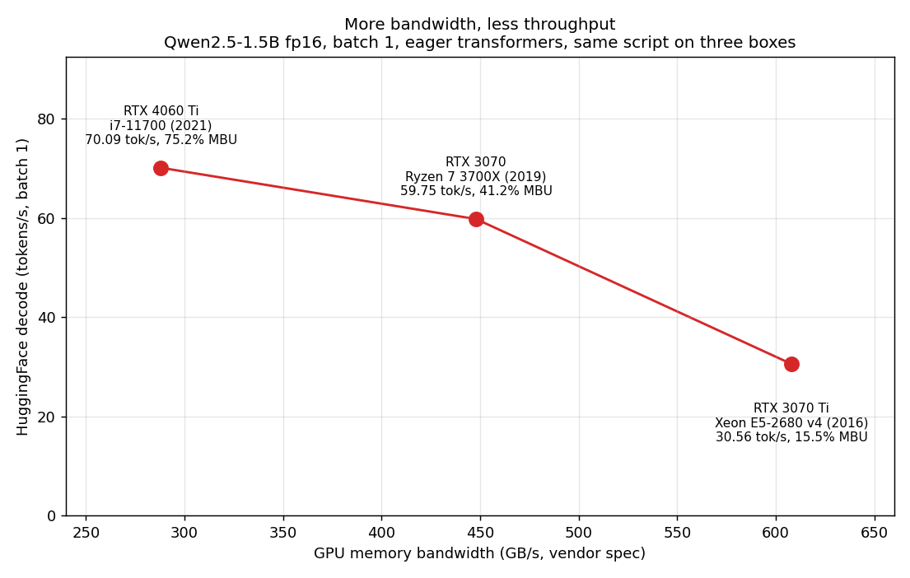
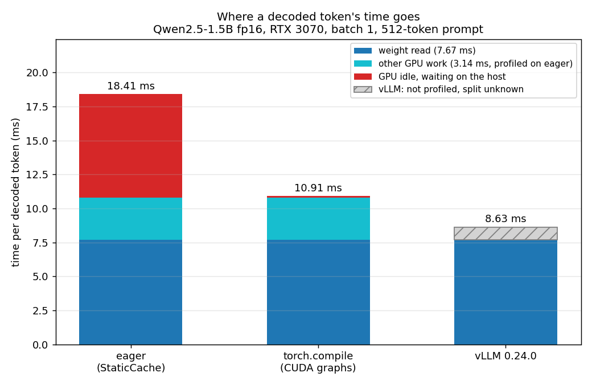

# Moving to a faster card made decoding slower

Decoding one token at a time is often limited by memory bandwidth, so I expected
a card with more bandwidth to decode faster. It did not: an RTX 3070 Ti with 608
GB/s decoded Qwen2.5-1.5B at 30.56 tokens per second, while an RTX 4060 Ti with
288 GB/s reached 70.09.

The reason is that memory bandwidth is not the only thing setting the pace.
Generating each token involves CPU-side dispatch and orchestration, and on these
systems, that CPU overhead became a significant part of the critical path. The
4060 Ti system had a substantially faster CPU than the 3070 Ti system, and in
this case that mattered more than the difference in GPU memory bandwidth. With
the hardware untouched and only the CPU-GPU handoff changed, decoding got 1.687x
faster.

## The thing that did not make sense

I have run the same script on three rented single-GPU boxes. Same model, same
prompt length, same number of generated tokens, same batch size of 1, plain
HuggingFace `transformers` in eager mode each time.

| card | spec bandwidth | HF decode | host CPU | MBU |
| --- | --- | --- | --- | --- |
| RTX 4060 Ti | 288 GB/s | 70.09 tok/s | i7-11700 | 75.2% |
| RTX 3070 | 448 GB/s | 59.75 tok/s | Ryzen 7 3700X | 41.2% |
| RTX 3070 Ti | 608 GB/s | 30.56 tok/s | Xeon E5-2680 v4 | 15.5% |

MBU is the share of the card's bandwidth the loop actually used: tokens per
second times 3.088 GB of weights per token, over spec bandwidth.

The order in those first two columns is exactly reversed. More bandwidth, less
throughput, every step of the way. The 3070 Ti has 2.11x the bandwidth of the
4060 Ti and 0.44x the throughput. What does line up is the CPU: the newest host
is fastest, the 2016 Xeon is slowest, and the 2019 Ryzen sits between them.

Why that looked wrong is worth saying plainly. Generating one token means reading
every weight in the model, once. Nothing else in the step moves anywhere near
that much data, so the speed limit is how fast the card can pull those bytes out
of its memory, and a card with more bandwidth should pull them faster. MBU is
just the fraction of that limit a run actually reaches. The low numbers in the
last column are saying that the cards with the most bandwidth spent most of their
time not using it. Something other than the memory system was setting the pace.

*Decode throughput against vendor memory bandwidth, batch 1, eager transformers.
Decode rates are medians from the committed baseline CSVs. Each point is a
different box, so CPU, GPU and torch build all change together; this is the
observation that motivated an experiment, not evidence of cause. Caveats in full
at the end.*

Each row is a different machine, so the CPU, the GPU and the torch and CUDA build
all change together. That makes this a correlation worth chasing, not a
demonstration that the CPU is responsible.

So I rented one box, the RTX 3070 in that table, and tried to test the idea
properly. Every measurement in the rest of this post comes from that machine. If
CPU-side dispatch is what limits eager decoding, then cutting the number of times
the CPU has to hand work to the GPU per token, with nothing about the hardware
changed, should recover the missing throughput.

## Setup

One NVIDIA RTX 3070, 8192 MiB, compute capability 8.6, 46 SMs, rented on
Vast.ai. PyTorch reports 7840 MiB of that as usable. Host is an AMD Ryzen 7
3700X with 16 logical cores, and the listing allocated 5.3 of 16 to my instance,
which matters later.

Model is Qwen2.5-1.5B in fp16: 28 layers, 12 query heads, 2 key/value heads,
head dimension 128. Weights sit at 2945.29 MiB resident, or 3.088 GB, and that
came out byte-identical on all three cards, which is how I check the model loaded
the same way everywhere.

Two Python environments, because vLLM pins its own torch and installing it
alongside the baseline would replace the torch the baseline was measured on. The
HuggingFace side ran torch 2.11.0+cu128 with transformers 4.46.3. vLLM 0.24.0
ran in a separate venv on torch 2.11.0+cu130.

Every run used a 512-token prompt and generated 255 tokens greedily at batch 1.
Prefill and decode are timed separately, never blended. I call
`torch.cuda.synchronize()` before reading any timer, discard a warmup generation,
and reset peak memory counters before each measured run.

## Finding the real ceiling first

The whole argument is a ratio, so I measured the denominator instead of trusting
it.

The RTX 3070 is specified at 448 GB/s. The Vast.ai dashboard reported 385.8
GB/s, and earlier in the same session it had reported 179.6 GB/s for the same
machine, which told me the dashboard figure moves with host load. So I measured
it: a large contiguous fp16 copy, best of 20 runs, gave 402.6 GB/s of combined
read and write traffic, 90% of spec.

At 402.6 GB/s, streaming 3.088 GB of weights takes 7.671 ms, so nothing can
decode faster than 130.4 tokens per second at batch 1 on this card.

Measured HuggingFace decode was 59.75 tokens per second, median of five runs
(55.07, 59.76, 58.03, 60.25, 59.75). That is 45.8% of the ceiling. Per token it
spends 16.74 ms where only 7.671 ms is unavoidable, leaving 9.07 ms of something
else.

The five runs span 9.4%, the first the slowest at 55.07 and the rest between
58.03 and 60.25. I ran five rather than two because I shared the CPU with other
tenants. vLLM on the same box gave 115.96, 115.57 and 115.84, a spread of 0.34%,
so the noise sits in the eager path, not the machine.

## Removing the CPU work, hardware unchanged

Producing one token in eager mode walks all 28 layers and submits a long series
of small kernels to the GPU, one at a time. `torch.compile` with
`mode="reduce-overhead"` captures that step once and replays it as a CUDA graph,
so the whole step is submitted in a single call.

Both arms used a preallocated `StaticCache`. CUDA graphs need shapes that do not
change, and a cache that grows by reallocation changes shape every token, so the
compiled arm required it. I used it in the eager arm too so the only difference
between the two was how work reaches the GPU.

| arm | decode | ms/token | MBU | leftover per token |
| --- | --- | --- | --- | --- |
| eager | 54.33 tok/s | 18.41 | 41.68% | 10.73 ms |
| compiled | 91.65 tok/s | 10.91 | 70.30% | 3.24 ms |

1.687x, same card, same process, same model, same cache. Measured instead against
the fastest eager configuration I had, the 59.75 tok/s baseline from earlier, the
gain is 1.53x. The first number is the controlled comparison and the second is
the honest one to quote against a normal setup; the gap between them is explained
in "What I got wrong".

In this execution path GPU kernels are launched from the CPU side, and the GPU
cannot execute a kernel until that work has been submitted to its command stream.
In eager mode each operation is submitted separately as the Python code runs, so
the submission cost is paid once per kernel. When kernels are long, that cost
disappears into them. When kernels are short, the GPU can drain the work it has
been given before more arrives, and it waits. A CUDA graph captures the sequence
once and replays it as a single submission, so a whole decode step reaches the
device without the host having to issue each launch again.

Prefill moved from 65.36 ms to 66.97 ms, so the compiled version was slightly
slower there. That is what I would predict if the gain came from removing
per-token dispatch cost. Prefill processes the whole prompt in one pass, so its
kernels are large enough to keep the GPU busy on their own and there was no gap
for graphs to close. Decode is the opposite shape: many short kernels, repeated
once per token. That only one of the two phases moved is the part that convinced
me the explanation fits.

*Per-token decode time on the RTX 3070, in milliseconds. The GPU-busy figure was
profiled on the eager path only and reused for the compiled bar, which is an
assumption rather than a measurement. vLLM was never profiled, so its bar shows
total wall time with the split left blank.*

## A second measurement of the same thing

I profiled twelve steady-state decode steps with `torch.profiler`, counting only
device-side kernels.

One decode token launches 1282 CUDA kernels. Total GPU time across them is 10.806
ms, so the average kernel runs for 8.429 microseconds. The largest single
contributor is a `gemv2T_kernel_val` half-precision kernel, 57 launches per
token totalling 5.019 ms.

Put that next to the wall-clock numbers above:

| arm | wall | GPU busy | GPU idle |
| --- | --- | --- | --- |
| eager | 18.41 ms | 10.806 ms | 7.60 ms (41%) |
| compiled | 10.91 ms | 10.806 ms | 0.10 ms (1%) |

The compiled wall time lands within 0.1 ms of the GPU's own busy time. Two
methods that share no code agree: eager decoding leaves the card waiting 41% of
each token, and replaying the step as a graph closes that to roughly nothing.

Put the two profiler numbers side by side and the shape of the problem follows.
1,282 kernels per token, each averaging 8.429 microseconds of device time. At that
duration the per-launch submission cost is no longer small relative to the work
itself, and a GPU that finishes an 8-microsecond kernel has nothing queued behind
it until the host submits more.

The conclusion I would defend is narrow. In this batch-1 eager decode workload,
CPU-side dispatch overhead became large enough to prevent the GPU from staying
busy. That is not the same as saying CPU overhead is always the bottleneck in LLM
inference, and nothing here supports the general version. Batch size is what sets
the kernel duration, and batch 1 makes those kernels as short as they get.

My notes from earlier runs said "on the order of 500 kernels per token." That was
a guess I made from the layer count. The measured number is 1282, and I have
corrected it.

## What I got wrong

`StaticCache` is not free. Eager decoding with it ran at 54.33 tokens per second
against 59.75 with the normal cache, about 9% slower. So 1.687x is the speedup
within a controlled comparison, and against the fastest eager configuration I
measured the honest number is 91.65 / 59.75 = 1.53x. I report both.

My first profiler build summed GPU time over every event that had any, which
counted `aten::linear` wrapping `aten::matmul` wrapping `aten::mm` wrapping the
kernel that actually ran. It reported 39.67 ms of GPU work inside a 7.37 ms step
and a negative idle time. I filtered to device-side events only and measured wall
clock directly instead of reconstructing it from nested spans.

I had been attributing the whole HuggingFace-to-vLLM gap to launch overhead, and
the profiler shows that cannot be right. vLLM decodes a token in 8.63 ms, which is
less than the 10.806 ms of device time the eager path spends on its kernels.
Submitting less work cannot produce a token faster than the work itself takes, so
vLLM must also be running cheaper kernels. I cannot say how much of its advantage
is which, because I never profiled it.

## What this does not show

The three-card table cannot establish that the CPU caused the inversion. Every
row changes the CPU, the GPU, and the torch and CUDA build at the same time, so
nothing in it isolates one variable. The controlled result is the single-box
comparison, and even that shows only that per-token dispatch cost 7.60 ms on this
particular machine.

The sampling behind that table is uneven. The RTX 3070 figure is a median of five
runs and the 4060 Ti of two, but the 3070 Ti is a single run with no repeat, so I
have no spread for it at all. The host CPU is also only recorded in the result
file for the 3070 row; I added a `cpu_model` field to the logging partway through
this work, so the other two CPUs come from notes I wrote when I rented those
boxes rather than from the data.

MBU denominators are inconsistent. I measured achievable bandwidth only on the
RTX 3070, at 402.6 GB/s against a 448 GB/s spec. The other two rows divide by
vendor spec, which understates their MBU by roughly the 10% gap I measured on the
one card where I checked.

Everything here is batch 1, one model, one prompt length. Batch 1 is the case
where per-launch cost matters most, because it makes the GPU work per kernel as
small as it gets. None of this says anything about throughput under load.

The instance had 5.3 of 16 logical cores allocated, so another tenant's work
could have moved my eager numbers, and the 9.4% spread across five runs is
consistent with that. The vLLM and compiled paths were far more stable, which is
what I would expect if the noise enters through host-side work, though I did not
test that directly.

vLLM was never profiled. Its throughput is measured, but the split between fewer
launches and cheaper kernels is not, so any claim about why it is fastest would
be inference rather than measurement.

## The part I cannot explain yet

vLLM decoded at 115.84 tokens per second, 8.63 ms per token, against 91.65 and
10.91 ms for the compiled HuggingFace path. Both replay the step as a graph, so
launch overhead cannot be what separates them. The profiler measured 10.806 ms of
GPU time for the eager path, and vLLM's entire token takes less than that, which
means its kernels are doing the same math with less work. I do not know how that
2.28 ms splits between fused kernels, a better attention implementation, and
something I have not thought of, because I never profiled vLLM. That is the next
run.

The larger open question is whether any of this survives batching. Batch 1 is the
friendliest possible case for this effect: the work per kernel is as small as it
gets, so the cost of asking for it looms largest. On another card I measured vLLM
reaching 5,354 tokens per second at batch 128, and at that size the GPU has
enough work per step that the host has time to keep up. If the dispatch wall
disappears under load, then what I measured here is a fact about single-stream
latency and not about serving. Worth knowing which.
