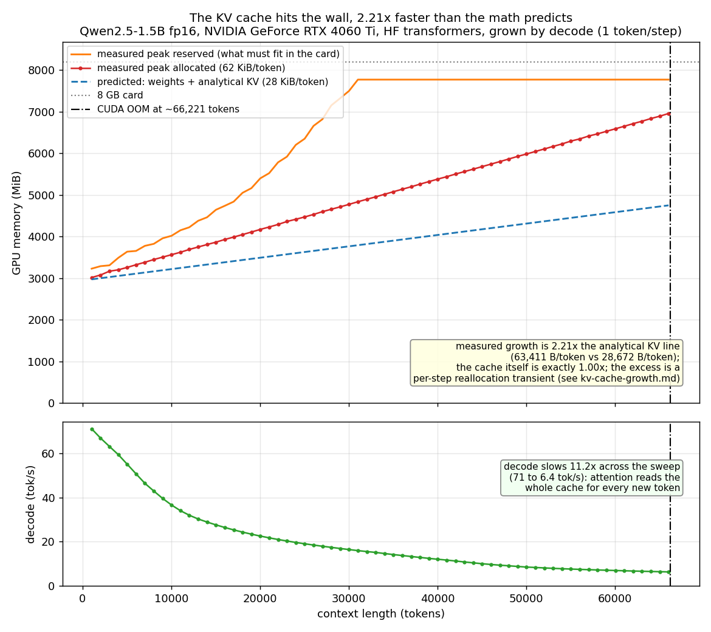
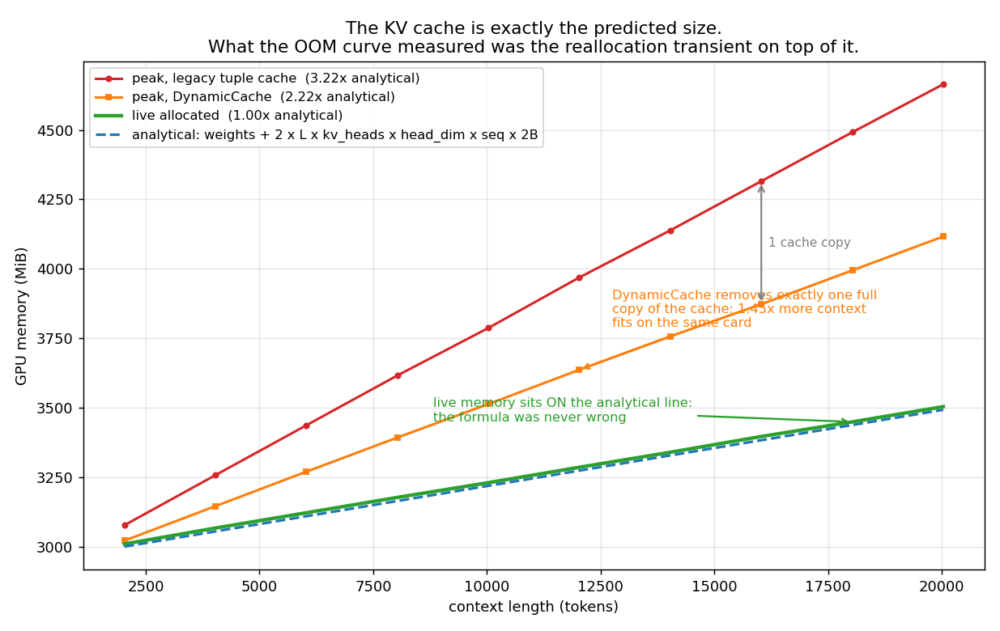

# The KV-cache formula was right. My OOM measurements were wrong.

The standard formula says a decoding run should add 28,672 bytes of KV cache per
token for this model. I measured peak GPU memory growing at 63,411 bytes per
token, 2.21x larger, and had no explanation for the gap.

The formula turned out to be exactly right. I was measuring the wrong quantity.

## The formula

For a transformer decoding one token at a time, each new token appends one key
and one value vector to the cache in every layer. For Qwen2.5-1.5B in fp16:

```
2 (key and value)
  x 28 layers
  x 2 key/value heads      (grouped-query attention: 12 query heads share 2 KV heads)
  x 128 head dimension
  x 2 bytes                (fp16)
= 28,672 bytes per token
```

The grouped-query factor is the one worth double-checking. If you use the 12
query heads instead of the 2 KV heads the answer comes out 6x too big, which is a
much more common mistake than being off by 2.21x.

## The measurement that did not agree

I ran a sweep that grows context by decoding, one token at a time, recording peak
GPU memory at checkpoints until CUDA runs out and the process dies. On an RTX
4060 Ti with 8GB, peak allocated memory grew at 63,411 bytes per token, and the
run crashed at about 66,221 tokens of context.



*Peak GPU memory against context length on an RTX 4060 Ti 8GB, Qwen2.5-1.5B fp16,
context grown by decoding one token per step. The measured curve rises 2.21x
faster than the analytical KV line. Single sweep, checkpoints every 1,000 tokens.*

Two lines matter here. The blue dashed one is weights plus the formula. The red
one is what the process actually peaked at. They diverge steadily, and by the
crash the gap is larger than a gigabyte.

If the cache really were growing at 63 KB per token, the formula would simply be
wrong. That seemed unlikely enough to be worth checking directly rather than
theorising about, so I stopped reasoning about memory totals and went to look at
the tensors.

## Looking at the cache itself

I wrote a probe that walks `past_key_values` during a normal decode loop and sums
the actual bytes held by the cache tensors, then compares that against the
prediction at each checkpoint. This ran on an RTX 3070 with torch 2.11.0+cu128
and transformers 4.46.3, same model and same fp16 weights.

The first cache tensor is shaped `(1, 2, 532, 128)` with dtype `torch.float16`,
and there are 56 of them, which is 28 layers times key and value. That single
line rules out the usual suspects. The dtype is fp16 and not accidentally fp32.
The 2 is the KV head count, so the heads are stored grouped rather than expanded
out to 12. The 128 is the head dimension with no padding.

Across ten checkpoints from 2,032 to 20,032 tokens of context:

| series | bytes per token | vs formula |
| --- | --- | --- |
| analytical KV | 28,672 | 1.00x |
| live cache tensors | 28,672 | 1.00x |
| live total allocation | 28,709 | 1.00x |
| everything that is not weights or cache | 37 | 0.00x |

The ratio of measured cache bytes to predicted is exactly 1.00 at every one of
the ten checkpoints, not 1.00 on average. Live allocation grows at 28,709 bytes
per token, which is the cache plus 37 bytes of everything else.

So the memory a decode loop actually holds is the formula, to three decimal
places.

## Three different quantities

The gap comes from the fact that "how much memory does the KV cache need" and
"how much memory does the process peak at" are not the same question, and I had
been treating them as one.

- **Analytical cache size.** What the formula gives. What the cache tensors
  occupy once they exist.
- **Live allocation.** What the process is holding at a given instant. Equal to
  the formula plus a negligible constant, as measured above.
- **Peak allocation.** The high-water mark. This is what `max_memory_allocated()`
  reports, what the OOM sweep recorded, and what determines whether the process
  survives.

Peak is larger because growing the cache is not free. Appending a token means
building a new tensor sized for the whole sequence while the previous one is
still referenced, so for a moment both exist. That transient never shows up in
live allocation if you sample between steps, and it always shows up in peak.

## How large the transient is depends on the cache implementation

transformers has more than one way to carry the cache, so I ran the same probe
twice, changing only that.

| cache implementation | peak growth | vs formula |
| --- | --- | --- |
| legacy tuple of tuples | 92,317 bytes/token | 3.22x |
| `DynamicCache` object | 63,595 bytes/token | 2.22x |

The difference between the two is 28,722 bytes per token, which is one full copy
of the cache to within 0.2%. The legacy path holds an extra complete copy alive
across the forward pass that the in-place path does not.



*Memory against context length on an RTX 3070, in MiB. Live allocation sits on
the analytical KV line at 1.00x. Peak runs 3.22x higher with the legacy tuple
cache and 2.22x with DynamicCache, a difference of one cache copy. Ten
checkpoints per implementation, single run each, no repeats.*

That 2.22x figure also matches the 2.21x I had measured on the 4060 Ti sweep to
within half a percent, which suggests that sweep was already on the more
efficient path and the remaining transient is simply what that path costs.

## What it costs in context length

Dividing the memory left after weights by each peak growth rate, on an 8 GiB card
with 2,945 MiB of weights resident:

```
legacy tuple    59,595 tokens
DynamicCache    86,509 tokens     1.45x more context
```

The cache implementation decides how much context fits before the process dies,
while changing no arithmetic and no output token.

These are numbers from one model on one card with one torch and transformers
version. The direction should hold anywhere the cache grows by reallocation, but
I would not carry the specific 1.45x anywhere without re-measuring it.

## What this does not show

One model, one GPU per measurement, one workload, batch 1. The OOM sweep is from
an RTX 4060 Ti and the cache probe from an RTX 3070, so the 2.21x and the 2.22x
are from different cards; they agree, but they are not the same run.

The transient behaviour is a property of how this version of transformers grows
its cache, and both the 3.22x and 2.22x factors are specific to that. A different
version, a preallocated cache, or a paged implementation would all put peak
somewhere else.

Each cache implementation was measured once, with no repeats. Memory figures are
deterministic in a way timings are not, so this matters less here than it would
for throughput, but the multipliers are one measurement each.

I did not verify the reallocation mechanism by inspecting allocator events
directly. That the cache measures exactly 1.00x and that the two implementations
differ by exactly one cache copy are both consistent with it, but the mechanism
is inferred from those two results rather than observed.

## The lesson

The formula answers the question it was always answering: how big is the KV
cache. It says nothing about the peak memory of the process that builds it, and
peak is what decides whether you get an out-of-memory error.

For capacity planning, the number to measure is peak. For understanding what the
cache costs, the formula was fine all along. I spent a while reading an OOM curve
as though it described the cache. It described the allocator.
